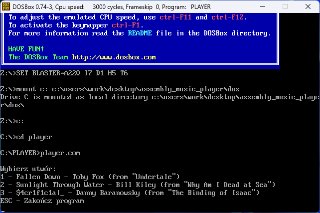
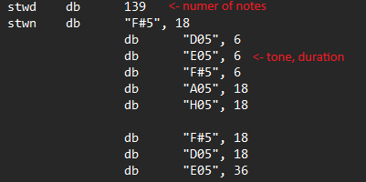

# Assembly Music Player

## General info

This is a simple music player for MS-DOS written in Assembly with three built-in video game OST pieces:

1. Fallen Down - Toby Fox (from "Undertale")
2. Sunlight Through Water - Bill Kiley (from "Why Am I Dead At Sea")
3. $4cr1f1c14|_ - Danny Baranowsky (from "The Binding of Isaac")

It's written in a way that adding new pieces of music is easy and straighforward. Detailed explanation of the code will be included in the next sections.

All of the music belongs to the respective composers. The arrangements included in this music player were made by me. 

## Technologies

- Assembly - all code was written in pure Assembly by hand in Notepad++
- NASM
- DOSBox

## Setup

1. Download, install and open [DOSBox](https://www.dosbox.com/)

2. Create a virtual drive in DOSBox with `mount c: [path to this repository on your machine]\dos`

3. Move to your virtual drive with `c:`

4. Open the folder with the app with `cd player`

5. Start the app with `player.com`

Now you can press a number on your keyboard to play the corresponding song or press ESC to close the app.

## Modification

If you want to modify the code (like adding more songs) you will have to edit the `SOUND.ASM` file.

Here is how the code works:

All songs are written in separate arrays with every note consisting of 4 bites. The first 3 are the tone and the last one is the length of the note. Just above the array with the notes, you have to declare a variable with the amount of notes that your song consists of.

For natural tones, the second bite is noted as `0`. Duration is artificial, so play with it a bit to see what works for your song.

All the tones supported by the app are in the `notes` array. Please note that half tones are noted as sharps only. If you want to add more tones, you have to add them to this array and then modify the `playsong` function accordingly.

To make the app play the song that you wrote in the array, you have to make a function that moves the address of the array to `bp` and then calls the function `playsong`.

You can edit the menu text in the `menutxt1` and `menutxt2` arrays. In the `inp` loop add the key you want to press to make your song play, and you're done!

Remember to run the `PLAY.BAT` script first after you modify the code.
